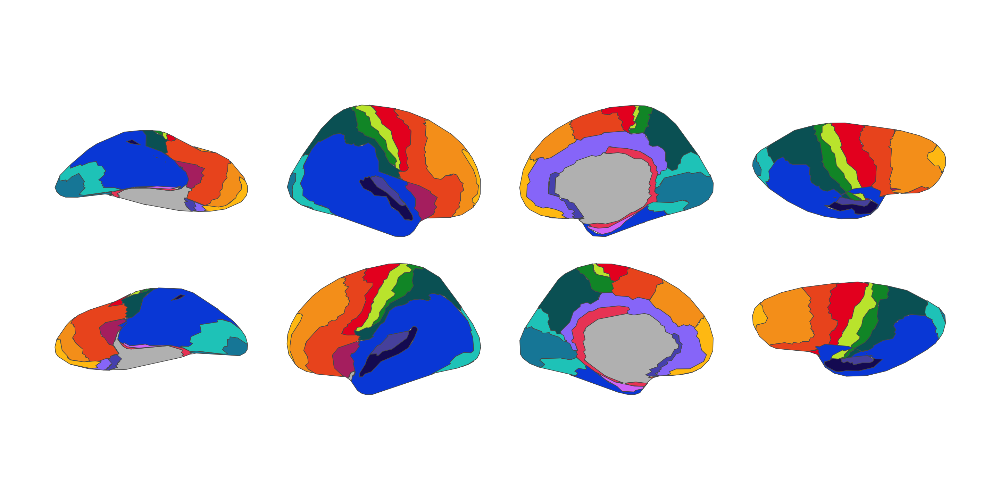
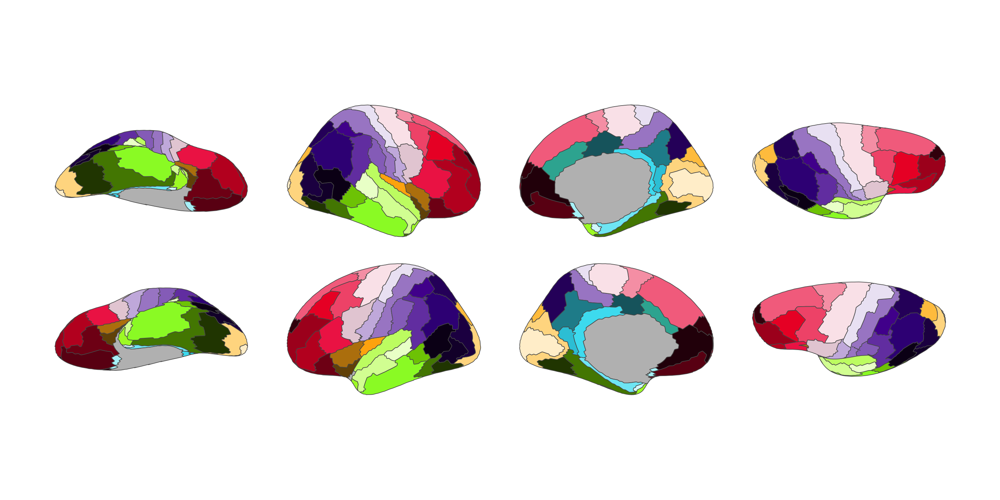
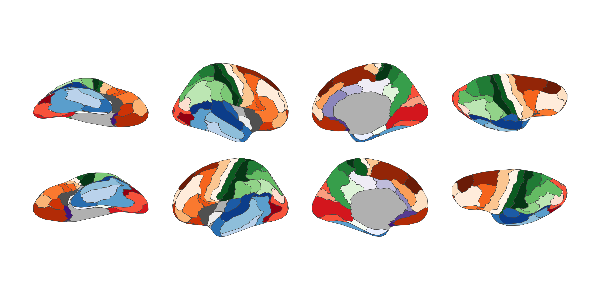

<!-- README.md is generated from README.qmd. Please edit that file -->

# ggsegHistorical

<!-- badges: start -->

[](https://github.com/ggsegverse/ggsegHistorical/actions/workflows/R-CMD-check.yaml)
[](https://ggseg.r-universe.dev/ggsegHistorical)
<!-- badges: end -->

This package provides six historical cortical brain atlases digitally
reconstructed by [Pijnenburg et
al. (2021)](https://doi.org/10.1016/j.neuroimage.2021.118274) from the
[Dutch Connectome Lab](http://www.dutchconnectomelab.nl/).

## Installation

We recommend installing the ggseg-atlases through the ggseg
[r-universe](https://ggseg.r-universe.dev/ui#builds):

``` r
options(repos = c(
  ggseg = "https://ggseg.r-universe.dev",
  CRAN = "https://cloud.r-project.org"
))

install.packages("ggsegHistorical")
```

You can install this package from [GitHub](https://github.com/) with:

``` r
# install.packages("pak")
pak::pak("ggsegverse/ggsegHistorical")
```

## Brodmann (1909)

``` r
library(ggseg)
library(ggsegHistorical)
library(ggplot2)

ggplot() +
  geom_brain(
    atlas = brodmann(),
    mapping = aes(fill = label),
    position = position_brain(hemi ~ view),
    show.legend = FALSE
  ) +
  scale_fill_manual(values = brodmann()$palette, na.value = "grey") +
  theme_void()
```


## Campbell (1905)

``` r
ggplot() +
  geom_brain(
    atlas = campbell(),
    mapping = aes(fill = label),
    position = position_brain(hemi ~ view),
    show.legend = FALSE
  ) +
  scale_fill_manual(values = campbell()$palette, na.value = "grey") +
  theme_void()
```



## Economo & Koskinas (1925)

``` r
ggplot() +
  geom_brain(
    atlas = economo(),
    mapping = aes(fill = label),
    position = position_brain(hemi ~ view),
    show.legend = FALSE
  ) +
  scale_fill_manual(values = economo()$palette, na.value = "grey") +
  theme_void()
```


## Flechsig (1920)

``` r
ggplot() +
  geom_brain(
    atlas = flechsig(),
    mapping = aes(fill = label),
    position = position_brain(hemi ~ view),
    show.legend = FALSE
  ) +
  scale_fill_manual(values = flechsig()$palette, na.value = "grey") +
  theme_void()
```



## Kleist (1934)

``` r
ggplot() +
  geom_brain(
    atlas = kleist(),
    mapping = aes(fill = label),
    position = position_brain(hemi ~ view),
    show.legend = FALSE
  ) +
  scale_fill_manual(values = kleist()$palette, na.value = "grey") +
  theme_void()
```


## Smith (1907)

``` r
ggplot() +
  geom_brain(
    atlas = smith(),
    mapping = aes(fill = label),
    position = position_brain(hemi ~ view),
    show.legend = FALSE
  ) +
  scale_fill_manual(values = smith()$palette, na.value = "grey") +
  theme_void()
```



## Data source

Pijnenburg R, Scholtens LH, Mantini D, & van den Heuvel MP (2021).
Digitally reconstructed cortical brain maps of the pioneers Brodmann,
Campbell, Economo and Koskinas, Flechsig, Kleist, and Smith.
*NeuroImage*, 239, 118274.
