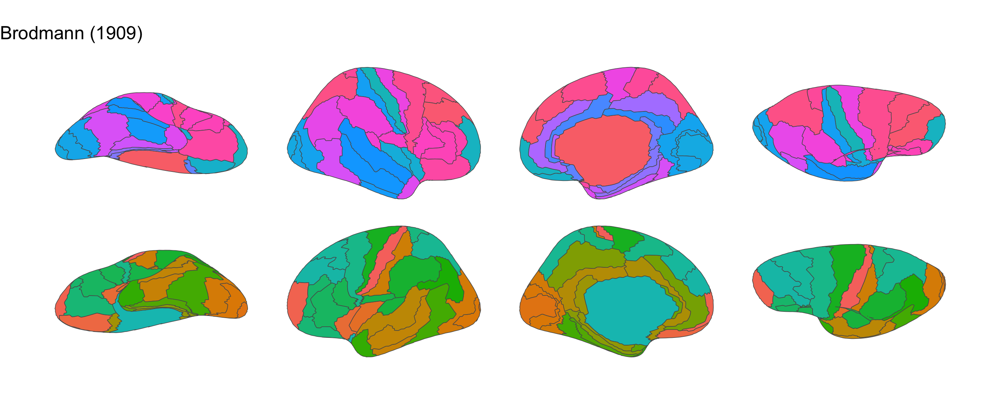
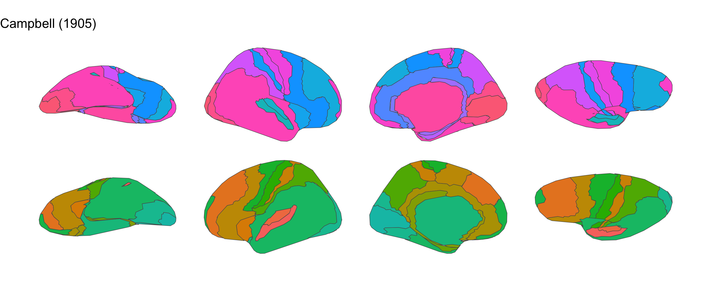
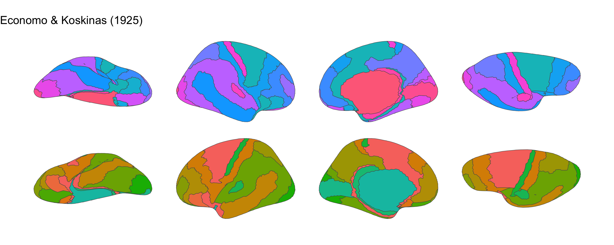
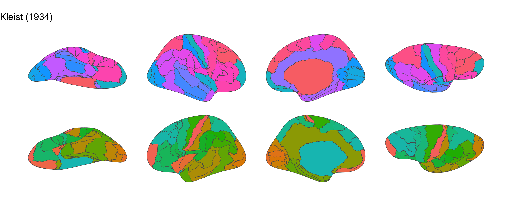
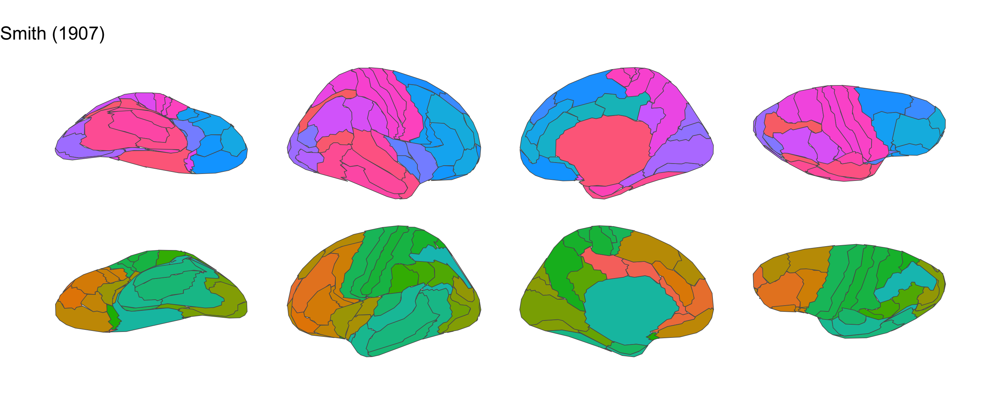

# ggsegHistorical

This package provides six historical cortical brain atlases digitally
reconstructed by [Pijnenburg et
al. (2021)](https://doi.org/10.1016/j.neuroimage.2021.118274) from the
[Dutch Connectome Lab](http://www.dutchconnectomelab.nl/), formatted for
use with [ggseg](https://ggseg.github.io/ggseg/) and
[ggseg3d](https://ggseg.github.io/ggseg3d/).

| Atlas              | Function                                                                           | Year | Regions/hemi | Type              |
|--------------------|------------------------------------------------------------------------------------|------|--------------|-------------------|
| Brodmann           | [`brodmann()`](https://ggsegverse.github.io/ggsegHistorical/reference/brodmann.md) | 1909 | 39           | Cytoarchitectonic |
| Campbell           | [`campbell()`](https://ggsegverse.github.io/ggsegHistorical/reference/campbell.md) | 1905 | 17           | Histological      |
| Economo & Koskinas | [`economo()`](https://ggsegverse.github.io/ggsegHistorical/reference/economo.md)   | 1925 | 15           | Cytoarchitectonic |
| Flechsig           | [`flechsig()`](https://ggsegverse.github.io/ggsegHistorical/reference/flechsig.md) | 1920 | 46           | Myelogenetic      |
| Kleist             | [`kleist()`](https://ggsegverse.github.io/ggsegHistorical/reference/kleist.md)     | 1934 | 49           | Functional        |
| Smith              | [`smith()`](https://ggsegverse.github.io/ggsegHistorical/reference/smith.md)       | 1907 | 14           | Anatomical        |

To learn how to use these atlases, please look at the documentation for
[ggseg](https://ggseg.github.io/ggseg/) and
[ggseg3d](https://ggseg.github.io/ggseg3d/).

## Installation

You can install ggsegHistorical from [GitHub](https://github.com/) with:

``` r
# install.packages("remotes")
remotes::install_github("ggseg/ggsegHistorical")
```

## Atlases

``` r
library(ggseg)
library(ggsegHistorical)
library(ggplot2)

ggplot() +
  geom_brain(
    atlas = brodmann(),
    mapping = aes(fill = label),
    position = position_brain(hemi ~ view),
    show.legend = FALSE
  ) +
  ggtitle("Brodmann (1909)") +
  theme_void()
```



``` r
ggplot() +
  geom_brain(
    atlas = campbell(),
    mapping = aes(fill = label),
    position = position_brain(hemi ~ view),
    show.legend = FALSE
  ) +
  ggtitle("Campbell (1905)") +
  theme_void()
```



``` r
ggplot() +
  geom_brain(
    atlas = economo(),
    mapping = aes(fill = label),
    position = position_brain(hemi ~ view),
    show.legend = FALSE
  ) +
  ggtitle("Economo & Koskinas (1925)") +
  theme_void()
```



``` r
ggplot() +
  geom_brain(
    atlas = flechsig(),
    mapping = aes(fill = label),
    position = position_brain(hemi ~ view),
    show.legend = FALSE
  ) +
  ggtitle("Flechsig (1920)") +
  theme_void()
```


``` r
ggplot() +
  geom_brain(
    atlas = kleist(),
    mapping = aes(fill = label),
    position = position_brain(hemi ~ view),
    show.legend = FALSE
  ) +
  ggtitle("Kleist (1934)") +
  theme_void()
```



``` r
ggplot() +
  geom_brain(
    atlas = smith(),
    mapping = aes(fill = label),
    position = position_brain(hemi ~ view),
    show.legend = FALSE
  ) +
  ggtitle("Smith (1907)") +
  theme_void()
```



## Citation

If you use these atlases, please cite:

> Pijnenburg R, Scholtens LH, Mantini D, de Reus MA, van den Heuvel MP
> (2021). Myelo- and cytoarchitectonic microstructural and functional
> human cortical atlases reconstructed in common MRI space.
> *NeuroImage*, 239, 118274.
> [doi:10.1016/j.neuroimage.2021.118274](https://doi.org/10.1016/j.neuroimage.2021.118274)

Please also cite the original historical atlas you use (see
[`?brodmann`](https://ggsegverse.github.io/ggsegHistorical/reference/brodmann.md),
[`?campbell`](https://ggsegverse.github.io/ggsegHistorical/reference/campbell.md),
etc. for individual references).

## License

The atlas data is released under a CC BY-NC-SA 4.0 license by
[Pijnenburg et
al. (2021)](https://doi.org/10.1016/j.neuroimage.2021.118274) from the
[Dutch Connectome Lab](http://www.dutchconnectomelab.nl/).
